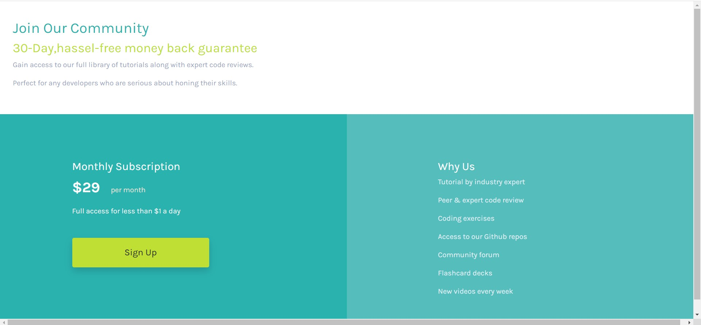

# Frontend Mentor - Single Price Grid component solution

This is a solution to the [Single price grid component challenge on Frontend Mentor](https://www.frontendmentor.io/challenges/single-price-grid-component-5ce41129d0ff452fec5abbbc). Frontend Mentor challenges help you improve your coding skills by building realistic projects. 

## Table of contents

- [Overview](#overview)
  - [The challenge](#the-challenge)
  - [Screenshot](#screenshot)
  - [Links](#links)
- [My process](#my-process)
  - [Built with](#built-with)
  - [What I learned](#what-i-learned)
  - [Continued development](#continued-development)
  - [Useful resources](#useful-resources)
- [Author](#author)


## Overview
This is a front-end project of a single-price-grid made as a part of a coding challenge on Frontend Mentor.Only HTML and CSS has been used for the implementation of this project.
### The challenge

Users should be able to:

- View the optimal layout for the component depending on their device's screen size
- See a hover state on desktop for the Sign Up call-to-action

### Screenshot




### Links

- Solution URL: https://github.com/Avik17/Single-Price-Grid-component-Project.git
- Live Site URL: https://avik17.github.io/Single-Price-Grid-component-Project/

## My process
  I started out this project with the sole purpose of brushing up my html and css concepts.I watched the videos of Web Development Udemy course by Angela.It is a very good course especially for the beginners.I wrote the html code first and then moved onto the css part for the styling.I was facing the problem of using just css for making the website responsive for different screens other than laptop/desktop like mobile phones using grid layout so I used Bootstrap grid layout instead as it saves a lot of effort.It took me a couple of days to get through this project but finally I was able to complete it. 

### Built with

- Semantic HTML5 markup
- CSS custom properties
- Bootstrap
- IDE - VS code


### What I learned

I got to revise the concepts of html and css during the whole process of making this project.
The new thing I learned during this project was about Grid layout system which can help you in deciding the appearance of your websites across different screens depending on their sizes.


```html
<div class="col-lg-6">
```

### Continued development

I would continue to learn about grid layout systems and CSS positioning properties as I faced some problems while implementing these in my project and am still not comfortable about it.Along with these I am looking forward to using Bootstrap more for designing the look of my websites in future projects.

### Useful resources

- https://www.udemy.com/course/the-complete-web-development-bootcamp/ - This helped me in learning in front-end development. I really liked this course and the way of teaching and will use it going forward.
- https://www.w3schools.com/css/default.asp - This is an amazing article which helped me getting to understand some properties of HTML and CSS. I'd recommend it to anyone still learning.


## Author

- Website - [Coming Soon]
- Frontend Mentor - [@Avik17](https://www.frontendmentor.io/profile/Avik17)
- Twitter - [@avik_1706](https://www.twitter.com/avik_1706)

